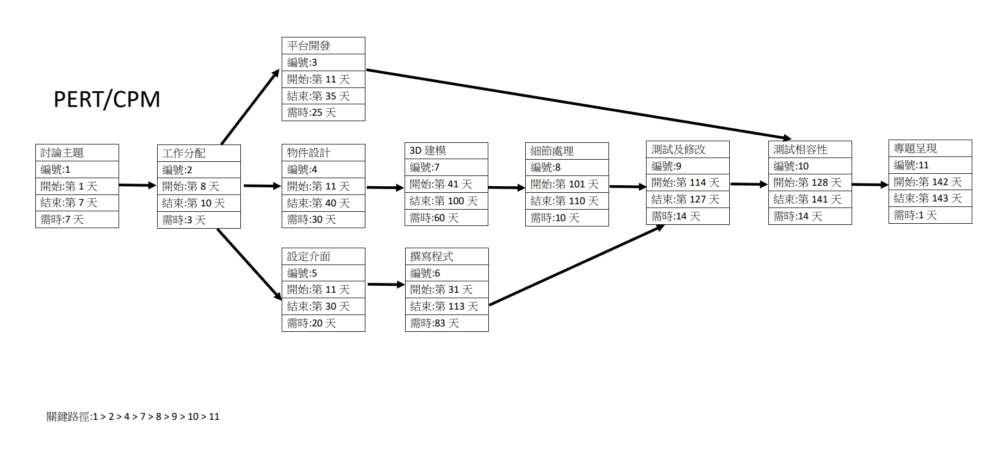

# 第十組

# 專題題目： AR菜單內容投影
---
 **組長：**
> C107118204 蔡明珊 

 **組員：**
> C107118205 李羿穎

> C107118221 戴妤珊

> C107118225 蔡馨儀

> C107118248 劉筱君
---
**分工：**
> 平台開發：李羿穎

> 3D 編程：蔡明珊、蔡馨儀

> 3D 開發軟件：戴妤珊、劉筱君
---
**內容：**
> 以AR顯示菜單品項
---
**甘特圖：**

---
**PERT/CPM圖：**

---  
**功能性需求與非功能性需求：**   
功能性：  
1.系統要提供給使用者的服務項目 : 讓顧客可以用3D預覽餐點   
2.處理流程與步驟 : 查詢、選擇與預覽餐點    
3.功能輸出為 : 以各種角度觀察餐點   
非功能性：   
1.反應時間(response time) ：使用者所觸發之事件的執行所將花費為10秒，點擊餐點即可預覽。   
2.使用性(usability)：一個正常的使用者所需之訓練時間為一天，只需要會載入品項清單與建模檔案。  
3.可靠度(reliability)：系統的失敗率為3%。   

---   
**需求分析：**     
一個AR菜單預覽系統的需求分析簡述如下：  
(1) 使用者可以藉由載入品項清單來產生菜單列表。 
(2) 使用者可以藉由載入建模檔案來增加品項預覽功能。 

--- 
**功能分解圖：**    
  

---   
**使用案例說明：**   
 
  
 

--- 
**使用案例圖：**    
    

--- 
**DFD圖：**    

--- 
**DFD 圖0：**    

--- 

**UML類別圖：**  

