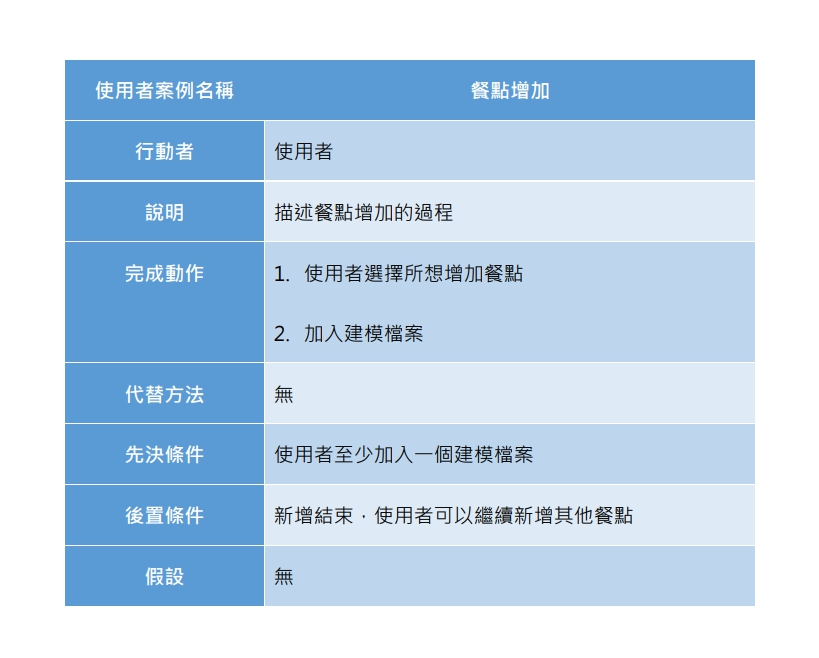

# 第十組

# 專題題目： AR菜單內容投影
---
 **組長：**
> C107118204 蔡明珊 

 **組員：**
> C107118205 李羿穎

> C107118221 戴妤珊

> C107118225 蔡馨儀

> C107118248 劉筱君
---
**分工：**
> 平台開發：李羿穎

> 3D 編程：蔡明珊、蔡馨儀

> 3D 開發軟件：戴妤珊、劉筱君
---
**內容：**
> 以AR顯示菜單品項
---
**甘特圖：**

---
**PERT/CPM圖：**

---  
**功能性需求與非功能性需求：**   
功能性：  
1.系統要提供給使用者的服務項目：讓顧客可以用3D預覽餐點，藉此得知餐點的實際份量及內容物 
2.處理流程與步驟：(1)依關鍵字搜尋相關餐點(2)從主頁或查詢結果中選擇所需餐點(3)APP打開相機提供餐點的3D預覽給顧客     
3.功能輸出為 : 開啟相機，以360度觀察餐點，顧客還可以放大縮小鏡頭來觀看細節。    
非功能性：   
1.反應時間（response time）：用戶所觸發的事件到系統執行並輸出結果的回應時間。   
2.使用性(usability)：一個正常的使用者所需之訓練時間為一天，只需要會載入品項清單與建模檔案。  
3.可靠度(reliability)：系統主要用來供顧客查詢餐點，呈現上傳後的3D物件，失敗率低。   

---   
**需求分析：**     
一個AR菜單預覽系統的需求分析簡述如下：  
(1) 使用者可以藉由載入品項清單來產生菜單列表。 
(2) 使用者可以藉由載入建模檔案來增加品項預覽功能。 
(3) 系統可以提供餐點的實際樣子給顧客觀看。
(4) 顧客點擊餐點預覽後，APP會打開手機相機，透過相機顯示3D物件。
(5) 查詢餐點後，系統依關鍵字回傳相關品項供顧客選擇。  

--- 
**功能分解圖：**    
  

---   
**使用案例說明：**   
 
  
 

--- 
**使用案例圖：**    
    

--- 
**DFD圖：**    

--- 
**DFD 圖0：**    

--- 

**UML類別圖：**   
 

--- 

**顧客餐點預覽**   
**循序圖：**   
   
**活動圖：**   
  

--- 

**顧客關鍵字查詢**    
**循序圖：**    
   
**活動圖：**  
  

--- 

**使用者新增餐點**    
**循序圖：**   
   
**活動圖：**   
 

---  

**分鏡圖**
**分鏡圖1：** 
 
**分鏡圖2：** 
 

---
  
**實體關係圖**

  
